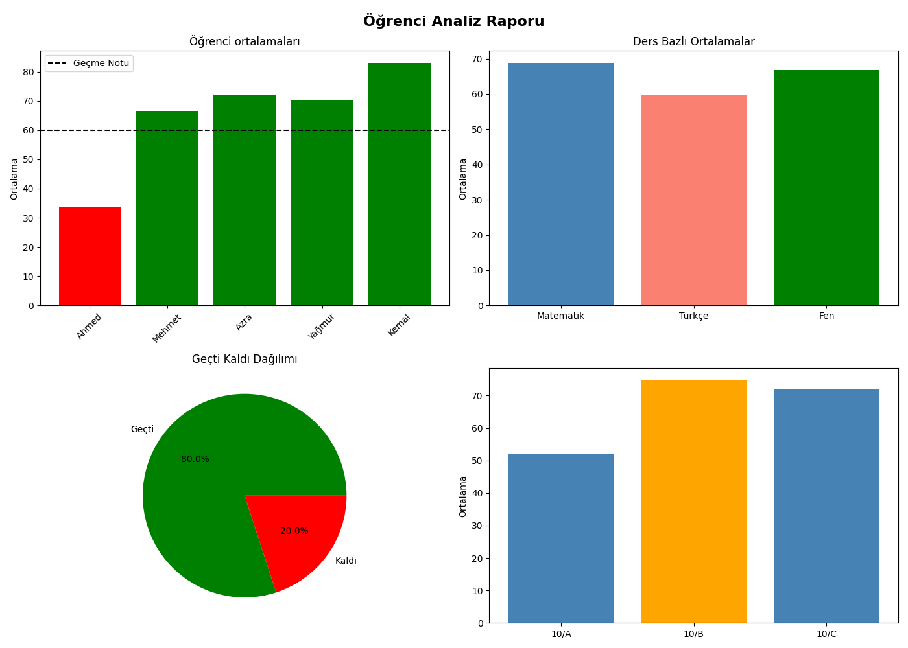

# Student Management System / Öğrenci Takip Sistemi

A Python-based student management and analysis system built with Pandas and Matplotlib.

Pandas ve Matplotlib kullanılarak geliştirilmiş öğrenci yönetim ve analiz sistemi.

This project analyzes:
- student performance
- attendance status
- class averages
- risky students

Bu proje:
- öğrenci performansını
- devamsızlık durumunu
- sınıf ortalamalarını
- riskli öğrencileri

analiz eder ve raporlar oluşturur.

---

# Features / Özellikler

## English

- Student average calculation
- Pass / Fail analysis
- Attendance risk detection
- Class-based analysis
- Automatic CSV report generation
- Data visualization with Matplotlib
- Risky student filtering
- Graph export system

## Türkçe

- Öğrenci ortalama hesaplama
- Geçti / Kaldı analizi
- Devamsızlık risk analizi
- Sınıf bazlı analiz
- Otomatik CSV rapor oluşturma
- Matplotlib ile veri görselleştirme
- Riskli öğrenci filtreleme
- Grafik dışa aktarma sistemi

---

# Technologies Used / Kullanılan Teknolojiler

- Python
- Pandas
- NumPy
- Matplotlib

---

# Project Structure / Proje Yapısı

```bash id="kw4x5f"
project/
│
├── pandas_ogrenci_takip.py
├── notlar.csv
│
├── rapor/
│   ├── grafik.png
│   ├── tam_rapor.csv
│   ├── riskli_ogrenciler.csv
│   └── sinif_analizi.csv
```

---

# Dataset Example / Veri Seti Örneği

```csv id="nb5w7v"
İsim;Yaş;Devamsızlık;Fen;Türkçe;Matematik;sınıf
Ahmed;20;4;41;10;50;10/A
Mehmet;15;2;84;74;41;10/B
Azra;45;6;36;80;100;10/C
Yağmur;21;8;78;70;63;10/A
Kemal;10;1;95;64;90;10/B
```

---

## Install libraries / Kütüphaneleri yükle

```bash id="w2m9qa"
pip install pandas numpy matplotlib
```

---

# Run The Project / Projeyi Çalıştırma

```bash id="u5k1rx"
python pandas_ogrenci_takip.py
```

---

# Generated Reports / Oluşturulan Raporlar

## English

The system automatically generates:

- Full student report
- Risky students report
- Class analysis report
- Performance visualization graphs

## Türkçe

Sistem otomatik olarak:

- Tam öğrenci raporu
- Riskli öğrenciler raporu
- Sınıf analiz raporu
- Grafik raporları

oluşturur.

---

# Visualization / Grafikler




## Generated Graphs / Oluşturulan Grafikler

- Student average bar chart
- Subject average analysis
- Pass / Fail pie chart
- Class comparison graph

- Öğrenci ortalama grafiği
- Ders ortalama analizi
- Geçti / Kaldı pasta grafiği
- Sınıf karşılaştırma grafiği

---

# Graph Preview / Grafik Önizleme

## Add your graph screenshot here

```md id="1kffhv"

```

---

# Example Visualization / Örnek Görselleştirme

(Grafik ekran görüntüsünü buraya ekleyebilirsin)

---

# Learning Goals / Öğrenme Amaçları

## English

This project was developed to practice:

- Data analysis with Pandas
- CSV processing
- Data visualization
- GroupBy operations
- Functional programming
- Report generation systems

## Türkçe

Bu proje aşağıdaki konuları geliştirmek için yapılmıştır:

- Pandas ile veri analizi
- CSV işleme
- Veri görselleştirme
- GroupBy işlemleri
- Fonksiyonel programlama
- Rapor oluşturma sistemleri

---

# Future Improvements / Gelecek Güncellemeler

- GUI support
- Database integration
- PDF export
- Web dashboard version
- Real-time tracking system

- Arayüz desteği
- Veritabanı entegrasyonu
- PDF raporlama
- Web dashboard sistemi
- Gerçek zamanlı takip sistemi

---

# Author

Ahmed Sevindik